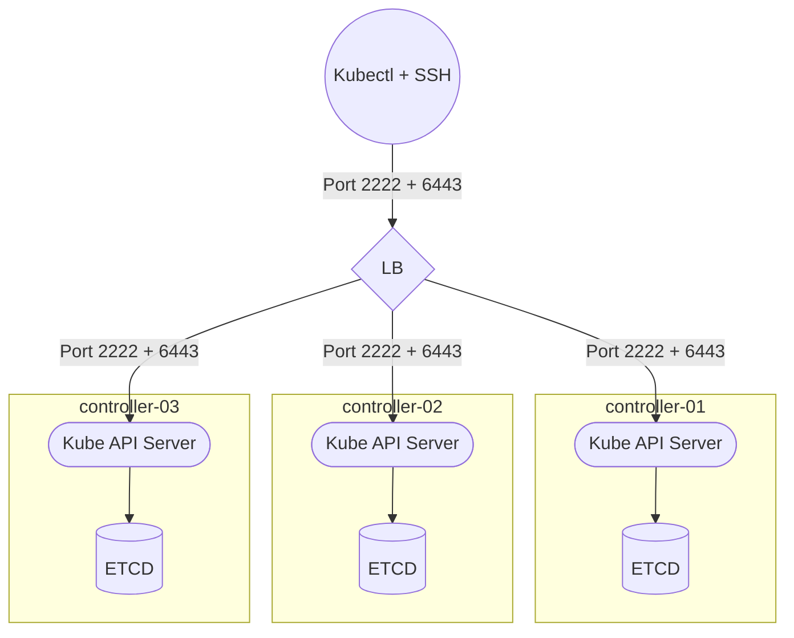

# Terraform Hetzner Cloud K3S

## 🎯 About

Get a cheap HA-ready Kubernetes cluster in less than **5 minutes**, with easy configuration setup through simple Terraform variables, 💯 GitOps compatible !

This opinionated Terraform template will generate a ready-to-go cloud infrastructure through Hetzner Cloud provider, with preinstalled [K3S](https://github.com/k3s-io/k3s), the most popular lightweight Kubernetes distribution.

Additional controllers and workers can be easily added thanks to terraform variables, even after initial setup for **easy upscaling**. Feel free to fork this project in order to adapt for your custom needs.

Check [Kube-Hetzner](https://github.com/kube-hetzner/terraform-hcloud-kube-hetzner) for a more advanced setup with Hetzner Cloud with optimized OS for containers workload. This project uses only OS supported by Hetzner and intends to be far more lightweight without any local/remote exec provisioners (only cloud-init), quicker to set up, and Windows compatible.

> I will always insist that you may not need Kubernetes. For any personal usage and apart from K8S learning, the [Swarm provider](https://github.com/okami101/terraform-hcloud-swarm) should be a better fit, as it's a far more lightweight orchestrator, whether in terms of machine resources (even it's K3s) or human brain.

### Networking and firewall

All nodes including LB will be linked with a proper private network as well as **solid firewall protection**. For admin management, only the 1st main control plane (bastion) node will have open ports for SSH (configurable) and kube-apiserver (port **6443**), with **IP whitelist** support. Other internal nodes will be accessed by SSH Jump.

Hetzner Load Balancer will be used for any external public access to your cluster.

### OS management

This Terraform template includes **[Salt Project](https://docs.saltproject.io)** as well for easy global OS management of the cluster through ssh, perfect for upgrades in one single time !

## ✅ Requirements

Before starting, you need to have :

1. A Hetzner cloud account.
2. A `terraform` client.
3. A `hcloud` client.
4. A `kubectl` client.

On Windows :

```powershell
scoop install terraform hcloud
```

## 🏁 Starting

### Prepare

The first thing to do is to prepare a new hcloud project :

1. Create a new **EMPTY** hcloud empty project.
2. Generate a **Read/Write API token key** to this new project according to [this official doc](https://docs.hetzner.com/cloud/api/getting-started/generating-api-token/).

### Setup

Now it's time for initial cluster setup.

1. Copy [this kube config example](kube.tf.example) into a new empty directory and rename it `kube.tf`.
2. Execute `terraform init` in order to install the required module
3. Replace all variables according your own needs.
4. Finally, use `terraform apply` to check the plan and initiate the cluster setup.

## Usage

### Access

Once terraform installation is complete, terraform will output the SSH config necessary to connect to your cluster for each node as well as following public IPs :

| Variable         | Description                                             |
| ---------------- | ------------------------------------------------------- |
| `bastion_ip`     | Bastion IP for OS and Kubernetes management             |
| `controller_ips` | All available IPs controllers for Kubernetes API access |
| `lb_ip`          | Load Balancer IP to use for any external public access  |
| `lb_id`          | Load Balancer ID to use for attaching any services      |

Copy the SSH config to your own SSH config, default to `~/.ssh/config`. After few minutes, you can use `ssh <cluster_name>` in order to log in to your main control plane node. For other nodes, the control plane will be used as a bastion for direct access to other nodes, so use `ssh <cluster_name>-worker-01` to directly access to your *worker-01* node.

### Salt

Once logged to your bastion, don't forget to active *Salt*, just type `sudo salt-key -A` in order to accept all discovered minions. You are now ready to use any `salt` commands for global OS management, as `sudo salt '*' pkg.upgrade` for global OS upgrade in one single time.

> If salt-key command is not existing, wait few minutes as it's necessary that cloud-init has finished his job.

### Kubernetes

#### Check K3S status

When logged, use `sudo kubectl get nodes -o wide` to check node status and be sure all nodes is ready and have proper private IPs. Then use `sudo cat /etc/rancher/k3s/k3s.yaml` to get the kubeconfig file and use it with your local kubectl (default to `~/.kube/config`). Adapt the IP accordingly to any valid public controllers IP.

You should now be able to use `kubectl` commands remotely to manage your cluster and ready-to-go to do some deployments !

#### Upscaling and downscaling

You can easily add or remove nodes by changing the `count` variable of each pool or control plane. Then use `terraform apply` to apply the changes.

* When adding, the K3S server or agent will be automatically added to the cluster and ready to use. Don't forget to accept the new minion with `sudo salt-key -A`.
* When removing, you should manually drain and delete node before removing the node with `sudo kubectl drain --ignore-daemonsets <cluster_name>-<pool>-<count>` and `sudo kubectl delete nodes <cluster_name>-<pool>-<count>`. Then use `terraform apply` to delete the node physically.

## Topologies

Contrary to Docker Swarm which is very flexible at low prices, with many topologies possible [as explained here](https://github.com/okami101/terraform-hcloud-swarm#topologies), K8S is really thought out for HA and high horizontal scalability, with complex workloads. So I will only present the typical HA topology for K8S based on following config :

```tf
# ...
control_planes = {
  #...
  count = 3
  taints = [
    "node-role.kubernetes.io/master:NoSchedule"
  ]
}

agent_nodepools = [
  {
    name = "web"
    #...
    count = 2
    taints = [
      "node-role.kubernetes.io/web:NoSchedule"
    ]
  },
  {
    name = "worker"
    #...
    count = 3
    taints = []
  },
  {
    name = "data"
    #...
    count = 2
    taints = [
      "node-role.kubernetes.io/data:NoSchedule"
    ]
  }
]

lb_target = "web"
# ...
```

### For administrators

Note as the LB for admin panel (which is not the same as the main frontal LB) is not included in this provider, but can be easily added separately. A round-robin DNS can be used as well.



### For clients

Next is a complete HA topology from top to bottom, with 3 controllers, 2 web nodes for traefik routing behind the LB, 3 workers supersided with Longhorn for replicated persistence, and 2 data nodes with replicated DB. Traefik can be merged to workers if you don't plan to have plenty of workers.


## 📝 License

This project is under license from MIT. For more details, see the [LICENSE](https://adr1enbe4udou1n.mit-license.org/) file.

Made with :heart: by <a href="https://github.com/adr1enbe4udou1n" target="_blank">Adrien Beaudouin</a>
